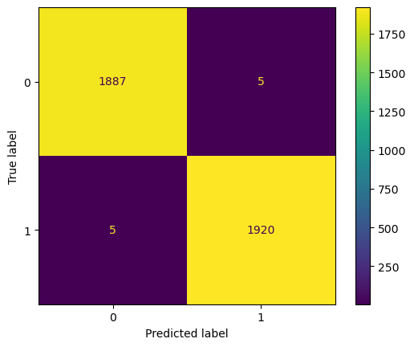
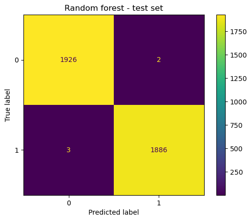

# Classification of TikTok videos

## Overview
Used statsmodels and scikit-learn to predict whether videos presented claims or opinions to improve triaging process of videos for human review.

## Business Understanding
TikTok is working on the development of a predictive model that can determine whether a video contains a claim or offers an opinion. With a successful prediction model, TikTok can reduce the backlog of user reports and prioritize them more efficiently.

## Data Understanding
The provided data consists of 19,382 entries, each with 12 different attributes. The first attribute is an integer column, likely serving as an index or identifier for each entry. The second attribute, ‘claim_status’, is an object column that could contain categorical data about the status of a claim, but it does have some missing values. The third attribute, ‘video_id’, is another integer column that likely represents unique identifiers for videos. The fourth attribute, ‘video_duration_sec’, is an integer column representing the duration of each video in seconds.

The fifth attribute, ‘video_transcription_text’, is an object column that possibly contains transcriptions of the video content, but it also has some missing values. The sixth and seventh attributes, ‘verified_status’ and ‘author_ban_status’, are object columns that likely indicate whether a video or author is verified and whether the author of a video has been banned, respectively.

The remaining five attributes are float columns representing various statistics about each video: the number of views (‘video_view_count’), likes (‘video_like_count’), shares (‘video_share_count’), downloads (‘video_download_count’), and comments (‘video_comment_count’). Each of these columns has some missing values.

## Modeling and Evaluation
Random forest and XGBoost used for modling and selects the best performance model to test the data.
The model's most predictive features were all related to the user engagement levels associated with each video. It was classifying videos based on how many views, likes, shares, and downloads they received.
The model currently performs nearly perfectly, there is no need to engineer any new features.
The current version of the model does not need any new features. However, it would be helpful to have the number of times the video was reported. It would also be useful to have the total number of user reports for all videos posted by each author.

    ### confusion_matrix for random_forest model: 

        

## Conclusion
In conclusion, this project aimed to develop a predictive model using statsmodels and scikit-learn to determine whether TikTok videos contain claims or opinions. The business objective was to enhance the triaging process of videos for human review, ultimately reducing user report backlogs and improving prioritization. The provided dataset included 19,382 entries with various attributes, primarily focused on video characteristics and engagement metrics.

The model successfully identified predictive features related to user engagement metrics such as views, likes, shares, and downloads, achieving near-perfect performance. While the current version of the model doesn't require additional feature engineering, it was suggested that including the number of video reports and aggregating user reports for each author could further enhance its capabilities. Overall, this project lays the foundation for TikTok to streamline content moderation and improve the user experience on the platform.

